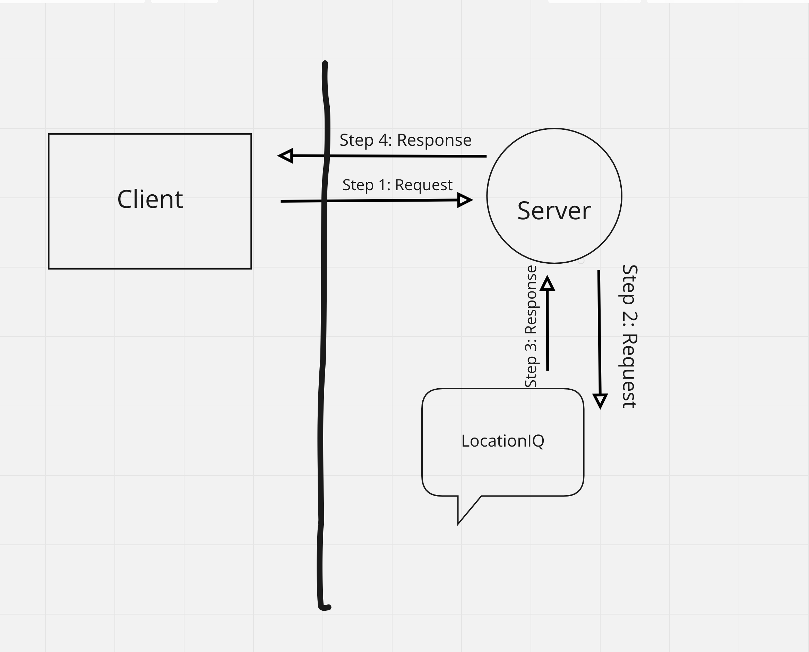

# City Explorer

**Author**: Regan Hayes
**Version**: 1.0.0 (increment the patch/fix version number if you make more commits past your first submission)

## Overview
<!-- Provide a high level overview of what this application is and why you are building it, beyond the fact that it's an assignment for this class. (i.e. What's your problem domain?) -->

## Getting Started
<!-- What are the steps that a user must take in order to build this app on their own machine and get it running? -->

## Architecture
<!-- Provide a detailed description of the application design. What technologies (languages, libraries, etc) you're using, and any other relevant design information. -->

## Change Log
<!-- Use this area to document the iterative changes made to your application as each feature is successfully implemented. Use time stamps. Here's an example:

01-01-2001 4:59pm - Application now has a fully-functional express server, with a GET route for the location resource. -->

## Credit and Collaborations
<!-- Give credit (and a link) to other people or resources that helped you build this application. -->

***

### January 17, 2022

Name of feature: API

Estimate of time needed to complete: 30 minutes

Start time: 8:30

Finish time: 9:15

Actual time needed to complete: 45 minutes

Name of feature: Locations

Estimate of time needed to complete: 3 hours

Start time: 9:30

Finish time: 11:30

Actual time needed to complete: 2 hours

### January 18, 2022

Name of feature: Server

Estimate of time needed to complete: 4 hours

Start time: 5:12pm

Finish time: 6:56pm

Actual time needed to complete: 2 hours
